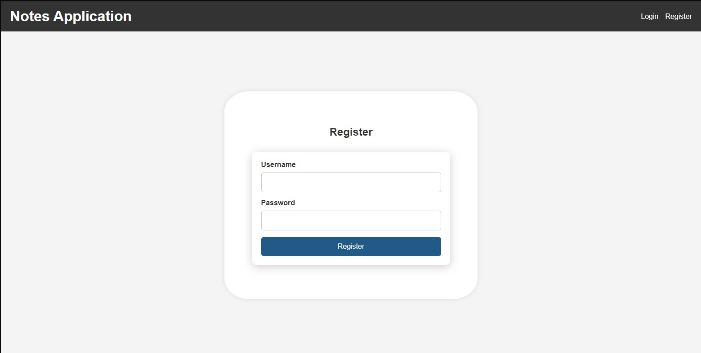
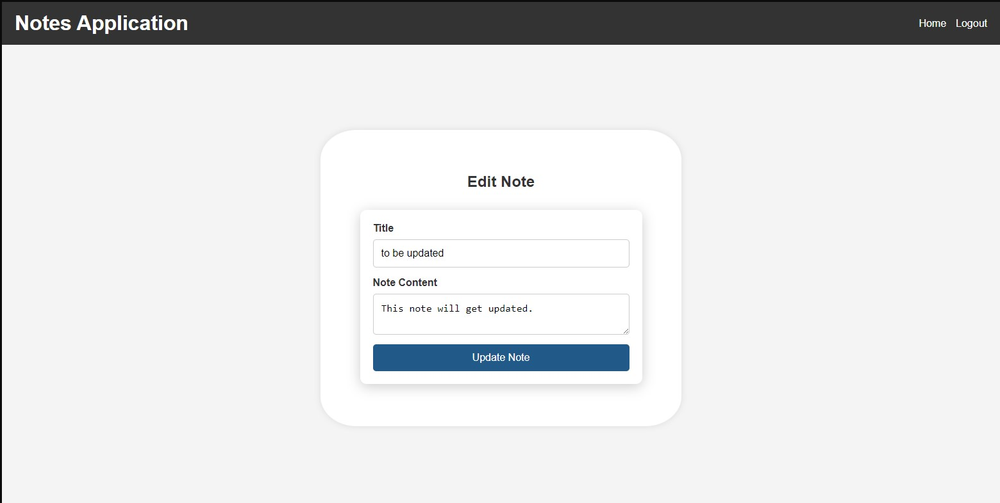

# Notes Application
#### Video Demo:  [Insert Video URL Here]
#### Description:

The **Notes Application** is a web-based platform developed using Flask, designed to help users create, manage, and organize their personal notes efficiently. This application provides a seamless user experience with functionalities including user registration, authentication, and full CRUD (Create, Read, Update, Delete) operations for managing notes. Leveraging SQLite as the backend database, the application ensures data persistence and security through password hashing and session management.

## Features

- **User Authentication**: Secure registration and login system allowing users to create accounts and access their personalized notes.
- **Create, Read, Update, Delete Notes**: Users can add new notes, view existing ones, edit their content, and delete notes as needed.
- **Responsive Design**: Clean and intuitive user interface designed with CSS to ensure a pleasant user experience across various devices.
- **Data Security**: Passwords are securely hashed, and user sessions are managed to protect sensitive information.


### File Descriptions

- **app.py**: The core Flask application file containing route definitions, database interactions, and application logic. It handles user authentication, session management, and CRUD operations for notes.
  
- **static/styles.css**: Contains all the CSS styles for the application, ensuring a consistent and appealing design across all pages. Styles are applied to forms, buttons, navigation, and overall layout.

- **templates/layout.html**: The base HTML template that other pages extend. It includes the header with navigation links that dynamically change based on the user's authentication status, and a main content block where page-specific content is rendered.

- **templates/index.html**: The homepage displaying the user's notes. It lists all notes associated with the logged-in user, providing options to edit or delete each note, and a button to add new notes.

- **templates/login.html**: The login page where existing users can enter their credentials to access their notes. It includes form validation and displays flash messages for feedback.

- **templates/register.html**: The registration page allowing new users to create an account by providing a unique username and password. It includes form validation and feedback messages upon successful registration or errors.

- **templates/note_form.html**: Used for both adding new notes and editing existing ones. It dynamically changes its heading and button text based on whether a note is being added or edited, and pre-populates fields when editing.

- **app.db**: The SQLite database file storing all user credentials and notes. It includes two primary tables:
  - **users**: Stores user information with fields for `id`, `username`, and `password` (hashed).
  - **notes**: Stores notes with fields for `id`, `user_id`, `title`, and `content`. The `user_id` links notes to the corresponding user.

- **requirements.txt**: Lists all Python dependencies required to run the project, ensuring that the application environment can be replicated accurately.

- **README.md**: This documentation file providing an overview of the project, setup instructions, and explanations of its components.

- **.gitignore**: Specifies files and directories that Git should ignore, such as the SQLite database file, virtual environment directories, and other temporary files.

## Installation and Setup

1. **Clone the Repository**

    Clone the project repository to your local machine:

    ```bash
    git clone https://github.com/Dexter88xD/notes_app
    cd notes_app
    ```

2. **Set Up a Virtual Environment**

    It is recommended to use a virtual environment to manage project dependencies:

    ```bash
    python3 -m venv venv
    source venv/bin/activate  # On Windows use `venv\Scripts\activate`
    ```

3. **Install Dependencies**

    Install the required Python packages using `requirements.txt`:

    ```bash
    pip install -r requirements.txt
    ```

4. **Run the Application**

    Start the Flask development server:

    ```bash
    python app.py
    ```

    Access the application by navigating to `http://127.0.0.1:5000/`, or the link provided in your terminal, in your web browser.

## Usage

1. **Register a New Account**

    Navigate to the registration page and create a new account by providing a unique username and password.
   

3. **Login**

    After registering, log in using your credentials to access the notes dashboard.
   

4. **Manage Notes**

    - **Add a New Note**: Click on the "Add New Note" button to create a new note by providing a title and content.
    - 
    - **Edit a Note**: Click on the "Edit" link next to a note to modify its title or content.
    - 
    - 
    - **Delete a Note**: Click on the "Delete" link next to a note to remove it from your collection.
    - 

5. **Logout**

    Click the "Logout" link in the navigation bar to end your session securely.
   

## Design Choices

- **Flask Framework**: Chosen for its simplicity and flexibility, Flask allows rapid development of web applications with a clean and modular structure.

- **SQLite Database**: Selected for its lightweight nature and ease of integration with Flask. Suitable for small to medium-sized applications, SQLite eliminates the need for setting up a separate database server.

- **Password Security**: Utilized Werkzeug's security module to hash passwords before storing them in the database, enhancing the security of user credentials.

- **Session Management**: Implemented Flask's session management to maintain user authentication states across different pages, ensuring secure access to user-specific data.

- **Responsive and User-Friendly Interface**: Designed the frontend with a clean and intuitive layout using CSS, ensuring a pleasant user experience and ease of navigation.

- **Modular Templates**: Employed Jinja2 templating to create reusable components and maintain consistency across different pages, reducing redundancy and improving maintainability.

## Future Enhancements

- **Enhanced Note Features**: Adding categories, tags, or the ability to attach files to notes for better organization.

- **Search Functionality**: Implementing search capabilities to allow users to find notes quickly based on keywords or titles.

- **Rich Text Editor**: Integrating a rich text editor to enable formatting within notes.

- **User Profile Management**: Allowing users to update their profile information, including password changes and profile pictures.

- **Deployment**: Deploying the application to a production environment using platforms like Heroku, AWS, or DigitalOcean for public access.

- **API Integration**: Developing RESTful APIs to allow integration with other services or mobile applications.

## Contributing

Contributions are welcome! If you have suggestions for improvements or find any bugs, please open an issue or submit a pull request.

## License

This project is licensed under the MIT Licence - see the [LICENSE](LICENSE) file for details.

## Acknowledgments

- [Flask](https://flask.palletsprojects.com/) for providing the web framework.
- [Werkzeug](https://werkzeug.palletsprojects.com/) for secure password hashing.
- [SQLite](https://www.sqlite.org/index.html) for the database solution.
